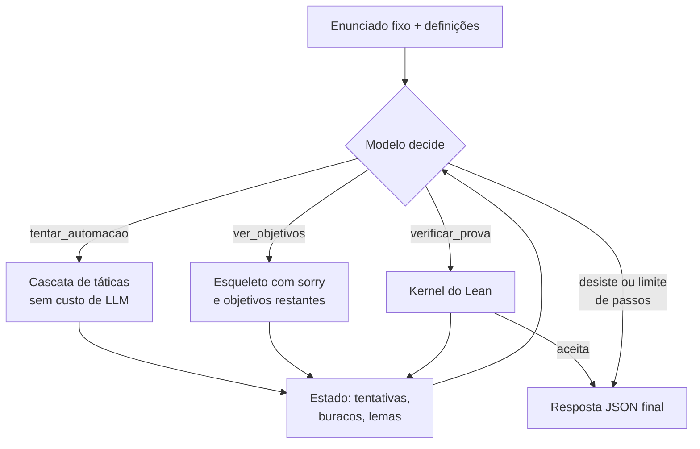

# Agente provador em Lean 4 — plano da Tarefa da Unidade I

Sep 22, 2026 · @Vinicius

## Veredito

Até 30/09 dá para entregar um agente que prova teoremas simples em **Lean 4 puro, sem mathlib**, com 3 a 4 ferramentas próprias e 10 casos de teste. Isso cumpre todos os requisitos e serve de MVP para o projeto final. A trilha longa (miniF2F, PutnamBench, eixo de pesquisa) fica para depois da entrega.

**A decisão que mais pesa é não usar mathlib nesta entrega.** Os motivos:

- **Reprodutibilidade.** O notebook precisa rodar do início ao fim sem intervenção. Com mathlib, isso significa baixar vários GB de cache e ficar os 15 a 20 minutos de setup que você mediu no Colab. Sem ela, basta instalar o executável `lean`.
- **Suficiência.** O Lean core já traz o necessário para teoremas sobre `Nat`, `List` e lógica proposicional: `omega`, `simp`, `decide`, `induction`, `exact?` e `apply?`. Essas táticas passaram para o core na versão 4.7 ([anúncio do Lean 4.7](https://blog.lean-lang.org/blog/2024-4-4-lean-470/)).
- **Velocidade do loop.** Sem `import Mathlib`, cada verificação leva segundos e usa pouca RAM. Com ela, cada verificação custa mais tempo e 4 a 6 GB de RAM.
- **O custo aceito.** Os benchmarks padrão, como o miniF2F, dependem de mathlib e ficam de fora. A tarefa pede 10 casos da dupla, então isso não é problema agora.

**Por que a tarefa é verificável:** o enunciado é fixado pela dupla em Lean e o agente só fornece a prova. O kernel do Lean aceita ou rejeita a prova, sem margem de interpretação. Para enunciados falsos, a resposta correta é uma prova verificada da negação.

Dois limites do que eu conferi: a API do `agentkit` é da disciplina e não a encontrei publicamente, então o código de integração abaixo é esboço a adaptar. Também não consegui executar o Lean aqui, porque o download foi bloqueado. As provas de referência precisam ser conferidas por vocês no 1º dia.

## Arquitetura do agente

O agente recebe um enunciado Lean fixo e o código Python monta o arquivo. O modelo nunca escreve o enunciado, só o bloco de táticas depois de `:= by`. Essa separação é o que impede o agente de "provar" uma versão mais fácil do teorema.



O modelo escolhe a ferramenta, a ordem e quando parar. O Python só impõe um limite de passos, por exemplo 12.

### Ferramentas (`@tool`)

| Ferramenta | Entrada | Devolve | Função no loop |
| --- | --- | --- | --- |
| `verificar_prova` | bloco de táticas e alvo (`original` ou `negacao`) | aceita/rejeita, erros com linha e mensagem | Único juízo de sucesso. Recusa `sorry`, `admit` e `native_decide` e confere `#print axioms`. |
| `ver_objetivos` | prova parcial com `sorry` nos buracos | hipóteses e objetivo de cada buraco (via `trace_state`) | Mostra o que falta depois de `induction`, `cases` ou `intro`. Sem ela, um modelo pequeno trabalha às cegas. |
| `tentar_automacao` | prova parcial com um `sorry` | quais táticas fecham aquele buraco (`rfl`, `decide`, `simp`, `omega`, `simp_all`, `exact?`) | Resolve os casos fáceis sem gastar tokens. O modelo guarda o raciocínio para a estrutura da prova. |
| `consultar_lema` (4ª, opcional) | nome do lema | tipo via `#check`, ou "não existe" | Corta nomes alucinados, sobretudo os de Lean 3 como `nat.succ_le_iff`. |

As três primeiras cumprem o requisito mínimo. A quarta só entra se sobrar tempo no dia 4.

### Mecanismos (dois principais e um complementar)

1. **Estado/memória (principal).** Um objeto Python `EstadoProva` por caso guarda enunciado, tentativas (prova → erro), esqueleto atual, buracos abertos e lemas confirmados. Ele tem duas funções reais. `verificar_prova` devolve o erro antigo em vez de recompilar uma prova idêntica, o que quebra o loop de repetição comum em modelos pequenos. E o contexto recebe um resumo compacto do estado em vez do histórico inteiro, o que economiza tokens da cota gratuita.
2. **Planejamento por esqueleto (principal).** Quando a automação não fecha, o prompt manda escrever primeiro a estrutura com `sorry` nos buracos, por exemplo `induction n with` e um `sorry` por caso. Depois o modelo confere com `ver_objetivos` e preenche um buraco por vez. O esqueleto que compila é o plano, e o estado registra o que falta. É a "decomposição por `sorry`" da sua lista, em escala de MVP.
3. **Saída estruturada (complementar).** A resposta final é um JSON `{veredito: provado | falso | desisto, prova, justificativa}`. O teste re-verifica a prova no Lean sem confiar no que o modelo afirma.

Deixei reflexão de fora de propósito. O erro do compilador já é o sinal de reflexão, e um passo extra de autocrítica seria enfeite, justamente o que o professor proíbe.

### Núcleo da verificação (Python puro, independente do agentkit)

Esboço não executado. Confiram no dia 2 com uma prova certa, uma errada e uma com `sorry`.

```python
import pathlib, re, subprocess, tempfile

PROIBIDO = re.compile(r"\b(sorry|admit|native_decide)\b")
MSG = re.compile(r"^.*?:(\d+):(\d+): (error|warning|info): ", re.M)

def checar_lean(preambulo: str, enunciado: str, prova: str, timeout: int = 30) -> dict:
    if PROIBIDO.search(prova):
        return {"aceita": False, "erros": ["prova usa sorry/admit/native_decide"]}
    corpo = "\n".join("  " + l for l in prova.strip().splitlines())
    codigo = f"{preambulo}\n\ntheorem alvo {enunciado} := by\n{corpo}\n\n#print axioms alvo\n"
    with tempfile.TemporaryDirectory() as d:
        arq = pathlib.Path(d) / "Alvo.lean"
        arq.write_text(codigo)
        try:
            r = subprocess.run(["lean", str(arq)], capture_output=True, text=True, timeout=timeout)
        except subprocess.TimeoutExpired:
            return {"aceita": False, "erros": [f"tempo esgotado ({timeout}s)"]}
    saida = r.stdout + r.stderr
    ms = list(MSG.finditer(saida))
    erros = []
    for i, m in enumerate(ms):
        fim = ms[i + 1].start() if i + 1 < len(ms) else len(saida)
        if m[3] == "error":
            erros.append({"linha": int(m[1]), "mensagem": saida[m.end():fim].strip()})
    aceita = not erros and "sorryAx" not in saida
    return {"aceita": aceita, "erros": erros}
```

Na integração, cada `@tool` é um invólucro fino que lê o caso atual de um `ESTADO` global (reiniciado a cada teste), chama `checar_lean`, registra o resultado e devolve JSON curto. A docstring de cada ferramenta é o que o modelo lê para decidir quando usá-la, então escrevam as docstrings com o mesmo cuidado do prompt. `ver_objetivos` e `tentar_automacao` reaproveitam o mesmo núcleo, com um parâmetro que libera sorry nos buracos, trocando `sorry` por `trace_state; sorry` ou por cada tática da cascata.

### Prompt de sistema: o que precisa conter

- "Lean 4, sem mathlib", mais um exemplo curto de sintaxe correta (`induction n with | zero => ... | succ k ih => ...`). Modelos pequenos escorregam para Lean 3 (`begin ... end`, `nat.succ`).
- As táticas do core disponíveis e o que cada uma resolve em uma linha (`omega` = aritmética linear em `Nat`/`Int`).
- O fluxo recomendado: automação → se falhar, esqueleto → objetivos → preencher → verificar.
- Quando suspeitar que o enunciado é falso: procurar contraexemplo pequeno e provar a negação com `alvo = negacao`.
- Critério de parada e formato do JSON final.

## Os 10 casos de teste

São 8 enunciados verdadeiros e 2 falsos, com dificuldade crescente, e os casos 8, 9 e 10 servem para explorar os limites. Um caso é aprovado quando o veredito bate com o esperado **e** a prova final é re-verificada pelo Lean fora do agente. Todos rodam em Lean core. As provas de referência são tarefa de vocês no dia 1: se a dupla não consegue provar um caso, ele sai da lista.

| # | Enunciado (depois de `theorem alvo`) | Nível | Esperado | O que exercita |
| --- | --- | --- | --- | --- |
| 1 | `(a b : Nat) : a + b = b + a` | fácil | provado | 1 chamada; a automação (`omega`) resolve |
| 2 | `(p q : Prop) (hp : p) (hq : q) : p ∧ q` | fácil | provado | termo direto `⟨hp, hq⟩` |
| 3 | `(p q : Prop) : p ∧ q → q ∧ p` | fácil | provado | `intro` e desmontar a conjunção |
| 4 | `∃ n : Nat, n * n = 49` | fácil | provado | exibir testemunha: `⟨7, rfl⟩` |
| 5 | `(p q : Prop) : (p → q) → ¬q → ¬p` | médio | provado | contrapositiva; `¬p` é `p → False` |
| 6 | `(a b : Nat) : a - b + b = a` | médio | **falso** (a = 0, b = 1) | subtração truncada de `Nat`; decidir parar e provar a negação |
| 7 | `(n : Nat) : dobro n = 2 * n` | médio | provado | esqueleto de indução e depois `simp [dobro]`/`omega` nos buracos |
| 8 | `(n : Nat) : 2 * soma n = n * (n + 1)` | difícil | provado | indução com termo não linear; `omega` sozinho não basta, exige reescrever antes |
| 9 | `(xs : List Nat) : rev (rev xs) = xs` | difícil | provado | precisa de um lema auxiliar (`have`) sobre `rev (as ++ bs)`, ou seja, planejar |
| 10 | `: ∀ n : Nat, n ^ 2 ≥ 2 * n` | difícil | **falso** (n = 1) | contraexemplo não óbvio (n = 0 funciona); resistir a tentar indução |

O preâmbulo com as definições usadas nos casos 7, 8 e 9 fica numa célula do notebook e entra antes de cada `theorem`:

```lean
def dobro : Nat → Nat
  | 0 => 0
  | n + 1 => dobro n + 2

def soma : Nat → Nat
  | 0 => 0
  | n + 1 => (n + 1) + soma n

def rev {α : Type} : List α → List α
  | [] => []
  | x :: xs => rev xs ++ [x]
```

Nos casos falsos, cada teste guarda também o enunciado negado escrito à mão, por exemplo `: ¬ ∀ a b : Nat, a - b + b = a`, e `verificar_prova(..., alvo="negacao")` usa esse texto. Assim o modelo nunca escreve enunciado nenhum.

Registrem por caso: veredito, aprovado sim/não, chamadas por ferramenta, passos, tokens e tempo. Esse log é o que prova ao professor que há casos com várias ferramentas e dá material para a análise de erros. Os casos 1 a 5 são de livro-texto e o modelo pode tê-los memorizado. Digam isso na análise: acertar esses casos mostra pouco, e os casos com definições próprias (7 a 9) são os informativos.

## Plano dia a dia

O baseline burro roda de ponta a ponta na sexta (25/09). Tudo depois disso é melhoria incremental sobre algo que já funciona. A conta é de cerca de 1 h por pessoa por dia, com a dupla em duas frentes: **A** cuida do Lean e das ferramentas, **B** do agentkit, do prompt e dos testes. Um dia só termina quando o portão passa.

| Dia | Pessoa A (Lean e ferramentas) | Pessoa B (agente e testes) | Portão do dia |
| --- | --- | --- | --- |
| Qua 23/09 | Instalar elan no WSL e fixar a versão do Lean. Provas de referência dos casos 1 a 5. | Mesma instalação. Provas de referência dos casos 6 a 10. Mandar ao professor a pergunta da seção de infra. | `Referencia.lean` com as 10 provas (ou casos trocados) compila sem erro e sem `sorry` nas duas máquinas |
| Qui 24/09 | `checar_lean` e testes: prova certa, errada, com `sorry` e com laço infinito (tempo esgotado) | Rodar o exemplo da aula do agentkit com o modelo escolhido e uma ferramenta trivial (`somar`) | Os 4 testes de `checar_lean` dão o resultado esperado, e o modelo chama `somar` com argumentos válidos |
| Sex 25/09 | `verificar_prova` como `@tool` | Prompt mínimo, laço de teste gerando a tabela (entrada, esperado, obtido, aprovado) | **Baseline:** agente com uma ferramenta roda os casos 1 a 4 e ao menos 1 é aprovado |
| Sáb 26/09 | `ver_objetivos` e `tentar_automacao` | `EstadoProva`: dedup de tentativas e resumo no contexto | No log do caso 7 aparecem ao menos 2 ferramentas diferentes |
| Dom 27/09 | Alvo `negacao` para casos falsos. `consultar_lema` se sobrar tempo. | Prompt com planejamento por esqueleto, JSON final e re-verificação independente | Rodada completa dos 10 casos com tabela e taxa de acerto, seja ela qual for |
| Seg 28/09 | Uma rodada de ajuste guiada pelos erros, registrando antes e depois | Rascunho do relatório e da análise de erros a partir do log | Relatório cobre o que o agente faz, por que é verificável e as decisões de projeto |
| Ter 29/09 | "Reiniciar e executar tudo" em ambiente limpo, na máquina do parceiro | Primeira célula com título e nomes, chave só por variável de ambiente, revisão final | Notebook roda do zero sem intervenção e com saídas salvas. Submeter. |
| Qua 30/09 | Folga para imprevisto |  | Prazo |

**Regra de corte.** Se o portão de sexta falhar, no sábado só se conserta o baseline. A ordem de corte é: `consultar_lema`, depois o caso 9 (troquem por uma indução simples sobre listas) e por último o terceiro mecanismo. Os dois mecanismos principais e as três ferramentas não são cortáveis, porque são requisito.

**Regra de honestidade no ajuste de segunda.** Mudem o prompt por categoria de erro ("usa sintaxe de Lean 3"), nunca por caso ("no caso 9 use `have`"). Ajustar o prompt para cada teste infla a taxa de acerto e invalida a análise.

## Trilha de estudos mínima

São cerca de 5 horas por pessoa, concentradas entre quarta e sexta. Na prática, isso estoura 1 h/dia nos dois primeiros dias. Se não houver folga, a pessoa B faz só as etapas 1 e 3 e aprende o resto implementando. Cada etapa tem um portão: quem não consegue fazer o exercício ainda não deve avançar.

| Etapa | Material | Tempo | Portão |
| --- | --- | --- | --- |
| 1. Lógica de volta | o resumo abaixo | 30 min | No papel: contrapositiva e recíproca de "se n² é par, então n é par", dizendo qual é equivalente. Negar "para todo n, n² ≥ 2n". |
| 2. Lean sem instalar | [Natural Number Game](https://adam.math.hhu.de/#/g/leanprover-community/nng4), mundos Tutorial e Addition | 1h30 | Provar a comutatividade da adição no Addition World sem dica |
| 3. Proposições como tipos | [Theorem Proving in Lean 4](https://lean-lang.org/theorem_proving_in_lean4/), cap. 3 (Propositions and Proofs) | 1h | Explicar por que `fun h hnq hp => hnq (h hp)` prova o caso 5 |
| 4. Táticas | mesmo livro, cap. 5 (Tactics) | 1h | Provar os casos 3 e 5 com táticas, sem consulta |
| 5. Indução | mesmo livro, cap. 8 (Induction and Recursion), só as seções de casamento de padrões e recursão estrutural | 1h | Provar o caso 7 com `induction` |

O Natural Number Game usa uma versão simplificada de algumas táticas, como `rw` e `induction`, então a sintaxe no Lean de verdade muda um pouco. Ele serve para pegar o jeito de indução, não para copiar sintaxe.

### Resumo de lógica para a etapa 1

- **Implicação** `p → q` só é falsa quando p é verdadeiro e q é falso. Em Lean, uma prova de `p → q` é uma função que recebe uma prova de p e devolve uma prova de q.
- **Contrapositiva** `¬q → ¬p` é equivalente à implicação original. É o caso 5.
- **Recíproca** `q → p` **não** é equivalente. "Se n é múltiplo de 4, n é par" vale, mas a recíproca falha em n = 2.
- **Negação** `¬p` em Lean é literalmente `p → False`, e é por isso que se prova com `intro`.
- **Negar um "para todo"** dá um "existe um contra": `¬(∀ x, P x)` equivale a `∃ x, ¬P x`. Os casos falsos 6 e 10 são exatamente isso: o agente mostra o contraexemplo.

Da trilha que você tinha pedido, ficam para depois da entrega: navegação na mathlib, o livro *Mathematics in Lean* (que depende de mathlib) e os benchmarks miniF2F e PutnamBench. Nada disso é usado nesta semana.

## Infra e custo do modelo

Rodem tudo no WSL2, com o Jupyter dentro dele (VS Code conectado ao WSL). Colab e container não são necessários sem mathlib. Para o modelo, usem Ollama local no desenvolvimento e uma API gratuita só nas rodadas finais.

### Lean

- Instalar pelo elan fixando a versão: `curl -sSf https://raw.githubusercontent.com/leanprover/elan/master/elan-init.sh | sh -s -- -y --default-toolchain leanprover/lean4:v4.33.0`. Escolhi a 4.33.0 porque é a que o livro TPIL usa hoje. Qualquer versão estável serve, desde que seja a mesma nas duas máquinas e no notebook.
- A primeira célula de código do notebook procura `~/.elan/bin/lean`. Se não achar, roda o instalador acima e põe `~/.elan/bin` no `PATH` via `os.environ`. Assim o notebook se instala sozinho em Linux ou WSL.
- Em Windows sem WSL, o elan tem instalador PowerShell, mas isso é outro caminho de código. Só vale a pena se o professor for rodar em Windows puro.

**Pergunta para o professor no dia 1:** "O notebook depende do executável do Lean, que uma célula instala automaticamente em Linux, e de uma chave de API lida de variável de ambiente. Vocês vão reexecutar o notebook? Em qual sistema, e com a chave de quem?" A resposta decide se vale suportar Windows e se a rodada final deve usar modelo local.

### Modelo

| Opção | Limite relevante | Papel no projeto |
| --- | --- | --- |
| Ollama local, Qwen3 8B quantizado (cabe nos 8 GB da RTX 5050) | nenhum, além da velocidade | Desenvolvimento e depuração, rodadas ilimitadas. Fraco em Lean: espere acertos só nos casos 1 a 5. |
| Groq, plano grátis (por exemplo `gpt-oss-120b`) | 30 req/min, 1.000 req/dia, **200 mil tokens/dia** ([resumo de ago/2026](https://continuumcode.ai/guides/free-llm-api/)) | Rodadas finais |
| OpenRouter, modelos `:free` | 20 req/min, 50 req/dia sem créditos comprados | Reserva, pouco útil por causa do limite diário |
| Gemini Flash, plano grátis | varia por projeto (ver no AI Studio); no plano grátis o conteúdo é usado pelo Google | Alternativa ao Groq |

**Onde o custo dói: tokens por dia, não requisições.** Uma rodada completa tem 10 casos, até 12 passos cada e cerca de 3 mil tokens de contexto por chamada. No pior caso são uns 360 mil tokens, acima da cota diária do Groq. O resumo compacto do `EstadoProva` (em vez do histórico inteiro) e o limite de passos derrubam isso para perto da metade. Isso também é um bom argumento no relatório para o mecanismo de memória.

Confiram se o `LLMAPI` do agentkit aceita um `base_url` compatível com OpenAI. Groq, OpenRouter e Ollama expõem esse formato, então trocar de modelo vira só configuração. Se um dia preferirem pagar, um modelo "mini" custa centavos de dólar por rodada nesse volume. Confiram a tabela de preços atual antes.

No laço de testes: repetir com espera crescente quando vier erro 429 e salvar o resultado de cada caso em JSON assim que ele termina. Uma queda no caso 8 não pode custar a rodada inteira.

## Armadilhas

A mais perigosa é o agente "provar" outra coisa e a taxa de acerto parecer ótima. As outras custam tempo, esta custa a validade do trabalho.

| Armadilha | Sinal precoce | Contramedida |
| --- | --- | --- |
| Agente prova outra coisa: altera o enunciado, usa `sorry`, `native_decide` ou `axiom` | Acerto alto logo no início; provas suspeitamente curtas | Enunciado montado pelo Python, filtro de palavras proibidas, `#print axioms` e re-verificação fora do agente |
| Modelo não chama ferramentas direito | Responde texto em vez de chamar a ferramenta; argumentos com JSON inválido | Teste com `somar` no dia 2. Se falhar, troquem de modelo na hora, não no domingo. |
| Sintaxe de Lean 3 e nomes inventados | Erros `unknown identifier`, `begin`, `nat.` | Exemplo de sintaxe no prompt, `consultar_lema` e contagem dessa categoria na análise |
| Casos que a automação resolve sozinha | Log com 1 chamada em quase todos os casos, sem nada de múltiplas etapas | No dia 1, rodem a cascata de táticas nas provas de referência. Os casos 7 a 10 precisam falhar nela. |
| Agente repetindo a mesma tentativa | Mesma prova enviada várias vezes até o limite de passos | Dedup no `EstadoProva`, que responde "já tentado, erro foi X" |
| Mecanismo decorativo | Vocês não sabem dizer o que piora se o mecanismo sair | Uma ablação: rodar os 10 casos sem o resumo de estado e comparar tokens e acertos. Uma linha no relatório responde à exigência de "função real". |
| Tática travando | Chamada que não volta (`decide` em números grandes, `simp` em laço) | Tempo limite de 30 s no `subprocess` |
| Cota da API estoura na véspera | Erro 429 ou de cota diária | Rodada final no domingo ou na segunda, nunca na terça, com resultados salvos por caso |
| Notebook que só roda na máquina de quem escreveu | Caminhos absolutos, chave no código, Lean fora do `PATH` | Terça: rodar do zero no WSL do parceiro, com a versão do Lean fixada |
| Semana gasta aprendendo Lean em vez de construir o agente | Sexta sem baseline | Regra de corte do plano |

## Depois da tarefa: onde há valor real

Para o projeto final, o melhor eixo é medir quanto o scaffolding (esqueleto com `sorry` e cascata de automação) melhora um modelo pequeno ou gratuito. É barato, mensurável e continua direto do MVP desta semana.

**O que já está resolvido com muito mais compute.** O desempenho em competição é um deles. O Numina-Lean-Agent resolveu 12 de 12 problemas da Putnam 2025 com Claude Opus 4.5, usando orçamento de cerca de US$ 50 por problema e de até US$ 1.000 no problema mais difícil ([artigo](https://arxiv.org/abs/2601.14027)). Correr atrás desse número com modelo gratuito é perder e aprender pouco. A sua leitura inicial está certa: o valor desse sistema estava no scaffolding, não em treino. Mas o scaffolding dele roda sobre um modelo de fronteira.

**Os quatro eixos que você listou, avaliados para um projeto de disciplina:**

| Eixo | Precisa de mathlib | Mensurável objetivamente | Veredito |
| --- | --- | --- | --- |
| Decomposição por `sorry` com modelo pequeno | não (suíte própria) ou sim (miniF2F) | sim: acerto e tokens com e sem esqueleto | **Recomendado.** O MVP já é o baseline. |
| Recuperação de lemas | sim | sim | Bom, mas traz de volta o custo de infra da mathlib |
| Reparo de provas entre versões da mathlib | sim, várias versões | sim | Infra pesada demais para o prazo de uma disciplina |
| Autoformalização com checagem de fidelidade | sim | difícil: fidelidade exige julgamento humano | Interessante, mas arriscado como projeto avaliado |

Se o projeto final for pelo eixo recomendado, o desenho do experimento é: uma suíte de 30 a 50 enunciados em Lean core com definições próprias, para reduzir contaminação. Comparar três configurações (só `verificar_prova`, com automação, com automação e esqueleto) em dois modelos (local 8B e gratuito via API). Medir acerto e tokens por prova. Só depois disso vale considerar um subconjunto do miniF2F com mathlib.

## Fontes

- [Lean 4.7.0: omega, exact? e apply? no core](https://blog.lean-lang.org/blog/2024-4-4-lean-470/)
- [Theorem Proving in Lean 4](https://lean-lang.org/theorem_proving_in_lean4/)
- [Natural Number Game (Lean 4)](https://adam.math.hhu.de/#/g/leanprover-community/nng4)
- [Free LLM API: limites reais (ago/2026)](https://continuumcode.ai/guides/free-llm-api/)
- [Numina-Lean-Agent (arXiv 2601.14027)](https://arxiv.org/abs/2601.14027)
- [Repositório numina-lean-agent](https://github.com/project-numina/numina-lean-agent)
